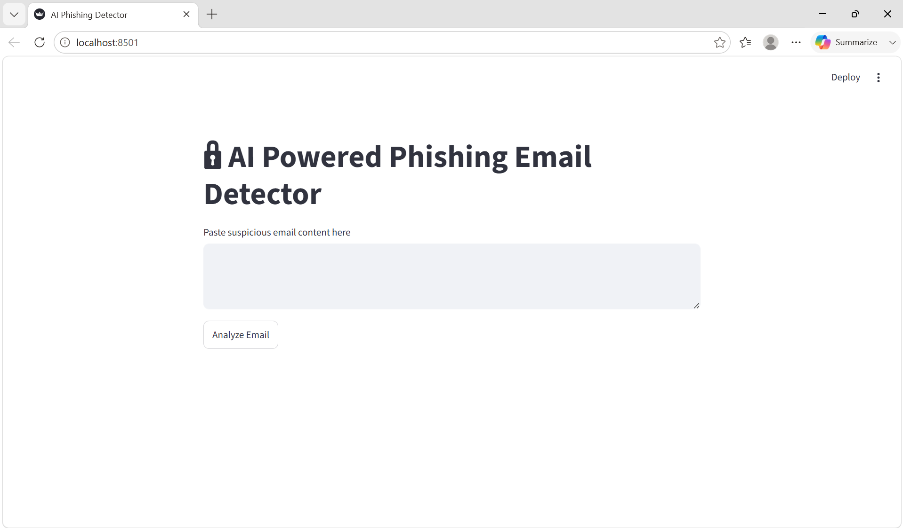
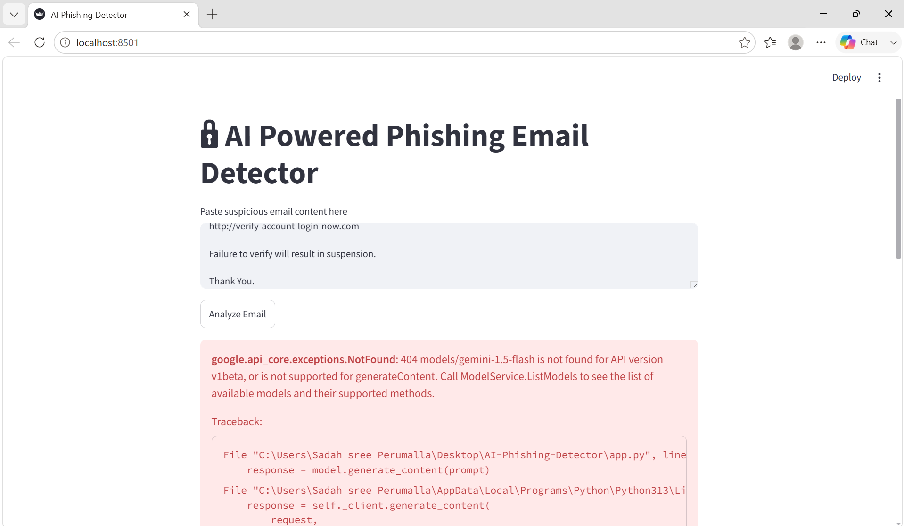

# AI Powered Phishing Email Detector
## Overview
The AI Powered Phishing Email Detector is a cybersecurity-focused web application that uses Google's Gemini AI model to analyze email content and identify potential phishing attacks. The application helps users assess suspicious emails by providing risk scores, threat analysis, and security recommendations.
---
## Features
- Phishing Email Detection
- Risk Score Generation
- Threat Level Analysis
- AI-Based Security Recommendations
- Interactive Web Interface using Streamlit
---
## Technologies Used
- Python
- Streamlit
- Google Gemini AI
- Generative AI
---
## Workflow
User Input
↓
Gemini AI Analysis
↓
Threat Detection
↓
Risk Assessment
↓
Security Recommendations
---
## Project Structure
AI-Phishing-Detector/

├── app.py

├── requirements.txt

├── README.md

└── screenshots/

    ├── home_v2.png
    
    └── result.png
---
## Skills Demonstrated
- Generative AI Integration
- Prompt Engineering
- Cybersecurity Awareness
- Python Development
- Streamlit Application Development
---
## Future Enhancements
- URL Scanning
- Attachment Analysis
- Malware Detection
- Real-Time Threat Intelligence
- Email Header Analysis
---
## Screenshots
### Home Page

### Analysis Result

---
## Author
Sadah Sree Perumalla
B.Tech Computer Science (Data Science)
